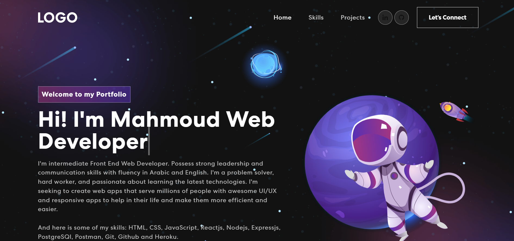

# Personal Portfolio Website in React

This project was bootstrapped with [Create React App](https://github.com/facebook/create-react-app).



## Getting Started 🚀

These instructions will get you a copy of the project up and running on your local machine for development and testing purposes.

### Prerequisites 📋

You'll need [Git](https://git-scm.com) and [Node.js](https://nodejs.org/en/download/) (which comes with [NPM](http://npmjs.com)) installed on your computer.

```
node@v16.4.2 or higher
npm@7.18.1 or higher
git@2.30.1 or higher
```

Also, you can use [Yarn](https://yarnpkg.com/) instead of NPM ☝️

```
yarn@v1.22.10 or higher
```

---

## How To Use 🔧

From your command line, first clone portfolio:

```bash
# Clone the repository
$ git clone https://github.com/mahmoudzanoun13/portfolio

# Move into the repository
$ cd portfolio

# Remove the current origin repository
$ git remote remove origin
```

After that, you can install the dependencies either using NPM or Yarn.

Using NPM: Simply run the below commands.

```bash
# Install dependencies
$ npm install

# Start the development server
$ npm start
```
Using Yarn: Be aware of that you'll need to delete the `package-lock.json` file before executing the below commands.

```bash
# Install dependencies
$ yarn

# Start the development server
$ yarn start
```
### `npm start`

Runs the app in the development mode.\
Open [http://localhost:3000](http://localhost:3000) to view it in your browser.

The page will reload when you make changes.\
You may also see any lint errors in the console.

### `npm run build`

Builds the app for production to the `build` folder.\
It correctly bundles React in production mode and optimizes the build for the best performance.

The build is minified and the filenames include the hashes.\
Your app is ready to be deployed!

See the section about [deployment](https://facebook.github.io/create-react-app/docs/deployment) for more information.

Built using:

- Front-end library: React
- CSS framework: React-bootstrap
- CSS animations library: Animate.css
